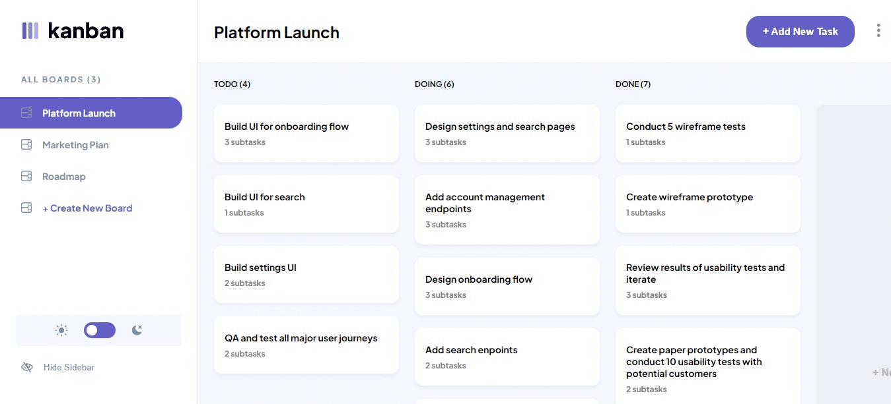

## React + Vite ile Hazırlanan Task Management Uygulaması

Bu uygulama, kullanıcıların görevlerini ve alt görevlerini düzenlemelerine, takip etmelerine ve tamamlamalarına yardımcı olur. Koyu ve açık tema seçenekleri arasında geçiş yapılabilir ve responsive tasarımı sayesinde tüm cihazlarda kullanabilir.

Uygulama Sayfası: https://www.frontendmentor.io/solutions/kanban-task-management-web-app-react-vite-jaG2D74bcg

Demo: https://frontend-mentor-guru-challenges.vercel.app

---

### Özellikler

- **Görev ekleme, düzenleme, tamamlama ve silme:** Kullanıcılar görev ekleyebilir, düzenleyebilir, tamamlandı butonu ile işaretleyebilir ve silebilirler.
- **Alt görevler:** Her göreve ait yeni alt görevler eklenebilir, silinebilir veya düzenlenebilir.
- **Pano ekleme, düzenleme, tamamlama ve silme:** Her panoya ait yeni görevler eklenebilir, panolar düzenlenebilir ve silinebilir.
- **Tema Seçimi:** Koyu veya açık tema arasından tercih yapılabilir.
- **Sidebar gizle/göster seçeneği:** Sidebar gizle ve göster seçeneği bulunmaktadır.
- **Responsive Design:** Farklı ekran boyutlarında sorunsuz çalışır.
- **localStorage:** Tüm veriler localStorage'da kayıt olmaktadır.

---

### Kullandığım Teknolojiler:

- React + Vite.
- Redux Toolkit.

---

### Kurulum ve Kullanım:

- **Adım 1: Klonlama:** `git clone https://github.com/gokhandemr/frontend-mentor-guru-challenges.git`
- **Adım 2: Proje Klasörünü Açma:** `cd frontend-mentor-guru-challenges/react-kanban-task-management/`
- **Adım 3: Npm Yükleme:** `npm install`
- **Adım 4: Çalıştırma:** `npm run dev`

---

### İletişim

_gkhandemir96@gmail.com_
