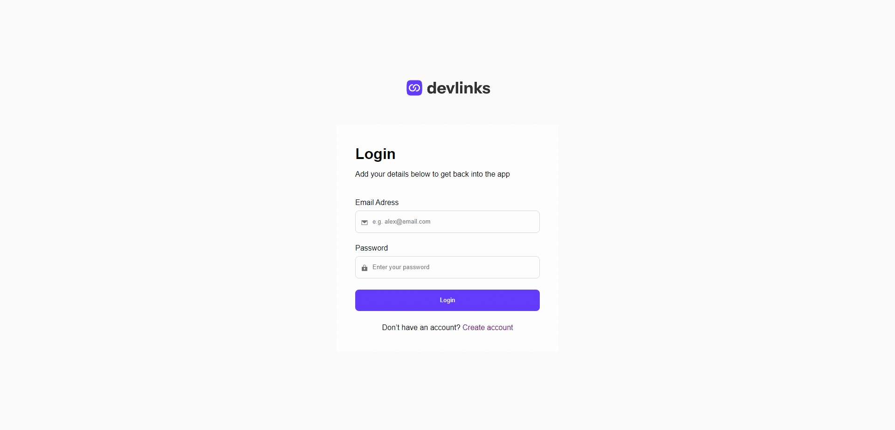

## Link Sharing App

Bu uygulama, kullanıcıların sosyal medya bağlantılarını tek bir ortamda listeleyebilecekleri tamamen işlevsel link paylaşım uygulamasıdır. Kullanıcılar bağlantılarını kolayca yönetebilir ve tüm cihazlarda kullanabilir.

Uygulama Sayfası: https://www.frontendmentor.io/solutions/link-sharing-app-EAwmvYJitO

Demo: https://link-sharing-app-khaki.vercel.app/

---

### Özellikler

- **Bağlantı oluşturma, güncelleme ve silme:** Kullanıcılar sosyal medya bağlantılarını kolayca yönetebilir.
- **Profil Bilgilerini Düzenleme:** Ad, soyad, email ve resim gibi detaylar yönetilebilir.
- **Kullanıcı Profil Adresini Paylaşma:** Kullanıcı profillerine kolay erişim için paylaş butonu kullanılabilir.
- **Responsive Design:** Farklı ekran boyutlarında sorunsuz çalışır.

---

### Kullandığım Teknolojiler:

- React + Vite.
- React Router DOM
- React Helmet Async
- Firebase

---

### Kurulum ve Kullanım:

- **Adım 1: Klonlama:** `git clone https://github.com/gokhandemr/frontend-mentor-guru-challenges.git`
- **Adım 2: Proje Klasörünü Açma:** `cd frontend-mentor-guru-challenges/react-link-sharing-app/`
- **Adım 3: Firebase Entegrasyonu:** `Firabase projesinde size verilen 'firebaseConfig' bilgilerini 'src' klasörü ile aynı seviyede olacak şekilde '.env' dosyası açarak içine kayıt etmelisiniz.`
- **Adım 4: .env Dosyası Örneği:** `VITE_FIRE_BASE_API_KEY=**** VITE_FIRE_BASE_AUTH_DOMAIN=**** VITE_PROJECT_ID=**** VITE_STORAGE_BUCKET=**** VITE_MESSAGING_SENDER_ID=**** VITE_APP_ID=****`
- **Adım 5: Npm Yükleme:** `npm install`
- **Adım 6: Çalıştırma:** `npm run dev`

---

### İletişim

_gkhandemir96@gmail.com_
